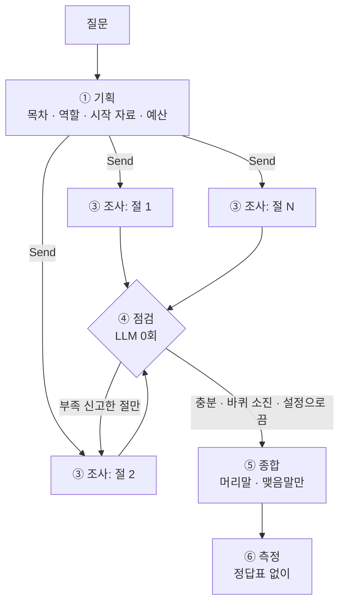

# market-deep-researcher

시장조사용 딥리서치 에이전트. 코디네이터가 질문을 보고 목차를 짜서 절마다 서브에이전트를 동시에 보내고,
서브에이전트는 자기 절의 자료만 읽고 원고를 써서 올린다. 코디네이터는 원고를 다시 쓰지 않고 머리말·맺음말만 붙인다.

> 상태: 파이프라인 동작 (기획 → 병렬 조사 → 재위임 → 종합 → 지표). 진행 상황은 [PROGRESS.md](PROGRESS.md), 실패 분석은 [REPORT.md](REPORT.md).

## 흐름



웹 화면(예정): 왼쪽은 대화(시장 구체화 → 자료 업로드 → 준비 완료 → 질문 → 목차 확인), 오른쪽은 진행 과정.

## 실행

```bash
pip install -r requirements.txt
python graph.py "질문"          # 뼈대 한 바퀴
python collect.py data/<시장>/corpus.json   # 코퍼스 통계 · 준비 여부
uvicorn app:app --reload        # 웹 데모 (http://localhost:8000)
```

LLM 백엔드는 `config.json` 의 `backend` 로 고른다.
- `claude_sdk`: Claude Agent SDK. 로컬에 로그인된 Claude Code 계정으로 돈다
- `openai`: `OPENAI_API_KEY` 환경변수 필요. **키는 저장소에 올리지 않는다** (`.env` 는 gitignore)

## 구조

| 파일 | 역할 |
|---|---|
| `config.json` | 절수 상한 · 절예산 · 바퀴 상한 · 수집 파트 · 스위치 |
| `llm.py` | LLM 호출 단일 창구 + 코디네이터/서브에이전트 글자 수 계측 |
| `graph.py` | 기획 → 배치 → 조사 → 점검 → 종합 (LangGraph) |
| `collect.py` | 코퍼스 수집 · 링크 생성 · 준비 여부 판정 |
| `metrics.py` | 근거율 · 허위 인용 · 편중 · 중복률 · 숫자 불일치 · 격리율 |
| `ablation.py` | 스위치를 하나씩 끄고 재는 실험 |
| `baseline.py` | 혼자 하는 대조군 (같은 읽기 예산) |
| `app.py`, `static/` | 웹 데모 |

## 코퍼스

`data/ev-battery/corpus.json` — 영어 위키백과 45건, 1,631,207자 (≈ 41만 토큰, Claude 창 200k 토큰의 2배).
문서당 링크 중앙값 12, 링크 0개 문서 없음. 본문은 [CC BY-SA 4.0](https://creativecommons.org/licenses/by-sa/4.0/) (Wikipedia contributors).
한국어 위키는 배터리 회사 문서가 1~3천 자로 짧아(LG에너지솔루션 1,024자) 영어로 바꿨다. 보고서는 한국어로 쓰고 인용만 영어 제목이다.

재수집: `python collect.py build ev-battery "Electric vehicle" "Lithium-ion battery" ... --n 45`
