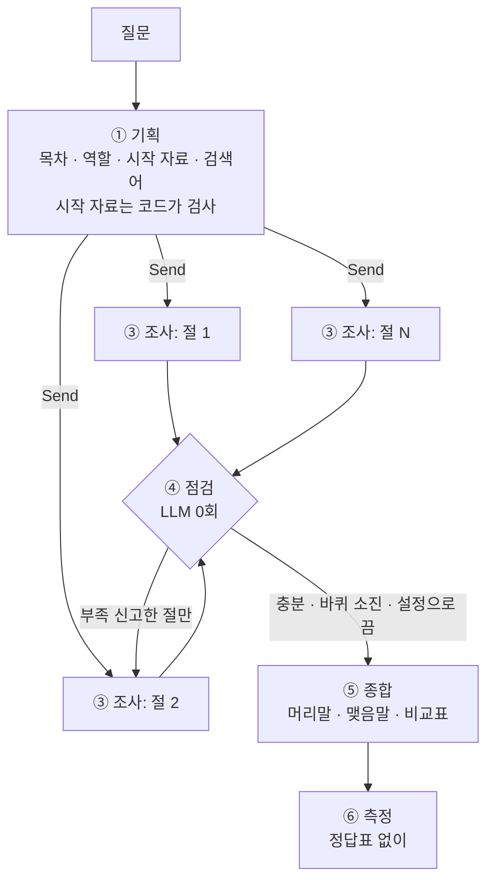

# market-deep-researcher

시장조사용 딥리서치 에이전트. 코디네이터가 질문을 보고 목차를 짜서 절마다 서브에이전트를 동시에 보내고,
서브에이전트는 자기 절의 자료만 읽고 원고를 써서 올린다. 코디네이터는 원고를 다시 쓰지 않고 머리말·맺음말만 붙인다
(비교표를 켜면 조사관이 붙인 비교 카드로 **코드가** 표를 만들고, 편집자는 그 표만 보고 비교 요약을 쓴다).

> 상태: 파이프라인 · 웹 데모 동작. 진행 상황은 [PROGRESS.md](PROGRESS.md), 설계 · 실험 · 실패 추적은 [REPORT.md](REPORT.md).

## 흐름



## 웹 데모

`uvicorn app:app` → http://localhost:8000

1 시장 정하기(봇이 목적 · 기간을 묻는다) → 2 자료(끌어다 놓은 PDF는 쪽 묶음으로 나눠 조사에 쓴다) → 3 목차 확인('예' / '빼기 N' / '다시', 읽을 문서에 주인공이 거의 없는 절엔 ⚠) → 4 조사(누가 무엇을 읽는지 실시간) → 보고서(인용은 `[1]`, 누르면 원문).
화면: [목차 확인](docs/demo/3_목차확인.png) · [조사 중](docs/demo/4_조사진행중.png) · [비교표와 업로드 자료 원문](docs/demo/7_업로드자료_인용.png) · [전체 8장](docs/demo/)

## 실행

```bash
pip install -r requirements.txt
python graph.py "질문" [라벨] [켤 스위치...]    # 예) python graph.py "한국 배터리 3사의 전략 차이는?" ct compare_table
python ablation.py --ids 1 3 7 --repeats 3    # 장치를 하나씩 끄는 실험 (끊기면 --retry-errors)
python compare.py --question-substr "배터리 3사" [--labels base baseline] [--repeat-index -1]   # 나란히 읽기 시트
python rescore.py [실행 폴더]                   # 지표 규칙을 바꾼 뒤 이전 실행을 다시 채점 (전후를 남김)
python metrics.py && python test_compare_table.py   # LLM 없이 도는 검사 (지표 · 비교표 · 업로드 조각 · 주인공 검사)
```

결과는 `output/runs/<시각>_<라벨>/` (목차 · 절 원고 · 모델 원본 응답 · 읽은 문서 · 비교 카드 · 보고서 · 지표)와 `output/runs.jsonl` 에 쌓인다.

LLM 백엔드는 `config.json` 의 `backend` 로 고른다.
- `claude_sdk`: Claude Agent SDK. 로컬에 로그인된 Claude Code 계정으로 돈다
- `openai`: `OPENAI_API_KEY` 환경변수 필요. **키는 저장소에 올리지 않는다** (`.env` 는 gitignore)

## 스위치 (`config.json` → `switches`)

| 스위치 | 기본 | 켜면 |
|---|---|---|
| `assignment` · `zones` · `redelegation` · `links` | 켬 | 시작 문서 배정 · 겹치지 않게 문서 나누기 · 부족한 절 재위임 · 링크 따라 읽기 (`ablation.py` 가 하나씩 끔) |
| `compare_table` | 끔 | 비교축 → 비교 카드 → 코드가 비교표 → 편집자가 표만 보고 비교 요약 (REPORT 4-4) |
| `uploads` | 끔 (데모는 켬) | `data/<시장>/uploads/` 의 PDF를 쪽 묶음(≤ 6,000자)으로 나눠 코퍼스에 합침 (REPORT 4-5) |
| `subject_check` | 끔 (데모는 켬) | 조사 전에 절마다 읽을 문서에 질문의 주인공이 나오는지 셈. 사람이 목차를 보면 ⚠ 표시만, 아니면 뺌 (REPORT 4-6) |
| `subject_rule` | 끔 | 조사관에게 "원문의 주어를 바꾸지 마라" (여러 회사를 묶은 문장을 한 회사 것으로 쓰지 않기) (REPORT 4-6) |
| `web_on_question` | 끔 | (아직 안 씀 — 웹 수집 자리) |

새 스위치는 모두 기본 끔이다. 끄면 프롬프트 · 보고서 · 읽은 문서가 2차 실험(54회) 때 코드와 글자 하나 다르지 않다 (가짜 LLM으로 대조).

## 구조

| 파일 | 역할 |
|---|---|
| `config.json` | 절수 상한 · 절예산 · 바퀴 상한 · 수집 파트 · 스위치 |
| `llm.py` | LLM 호출 단일 창구 + 코디네이터/서브에이전트 글자 수 계측 |
| `graph.py` | 기획 → 배치 → 조사 → 점검 → 종합 (LangGraph) · 비교표 · 업로드 조각 · 주인공 검사 |
| `collect.py` | 코퍼스 수집 · 업로드 읽기 · 링크 생성 · 준비 여부 판정 |
| `metrics.py` | 근거율 · 허위 인용 · 편중 · 중복률 · 숫자 불일치 · 격리율 |
| `ablation.py` | 스위치를 하나씩 끄고 재는 실험 |
| `baseline.py` | 혼자 하는 대조군 (같은 읽기 예산 · 같은 글쓰기 규칙) |
| `compare.py` · `rescore.py` | 나란히 읽기 시트 · 지표 규칙 바꾼 뒤 재채점 |
| `test_compare_table.py` | LLM 없이 도는 검사 (가짜 `llm.ask`) |
| `app.py`, `static/` | 웹 데모 |
| `docs/demo/` | 데모 화면 캡처 |

## 코퍼스

`data/ev-battery/corpus.json` — 영어 위키백과 45건, 1,631,207자 (≈ 41만 토큰, Claude 창 200k 토큰의 2배).
문서당 링크 중앙값 12, 링크 0개 문서 없음. 본문은 [CC BY-SA 4.0](https://creativecommons.org/licenses/by-sa/4.0/) (Wikipedia contributors).
한국어 위키는 배터리 회사 문서가 1~3천 자로 짧아(LG에너지솔루션 1,024자) 영어로 바꿨다. 보고서는 한국어로 쓰고 인용만 영어 제목이다.

재수집: `python collect.py build ev-battery "Electric vehicle" "Lithium-ion battery" ... --n 45`

업로드(데모): IEA *Global EV Outlook 2026* · *Batteries and Secure Energy Transitions* (CC BY 4.0). 파일은 저장소에 올리지 않는다 (`data/*/uploads/` 는 gitignore) — 받는 곳은 REPORT 4-5.
