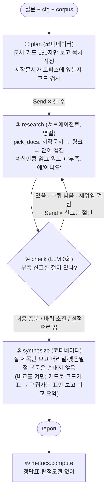

# REPORT

> 작성 중 (2026-09-26). "내 판단" 칸은 직접 채운다 (4-3 Q3 · 4-4 · 4-5 · 4-6, Q1 · Q7 은 읽기 노트).

## 1. 주제와 코퍼스

**주제: 전기차·배터리 시장조사.** "이 시장의 누가, 무엇으로, 어떻게 경쟁하나"는 한 문서로 답이 안 나오고, 회사 · 기술 · 소재 · 정책 문서가 각각 필요하다.
질문마다 목차가 달라진다 (회사별 / 기술별 / 시간순) — 교안이 말한 "목차가 건마다 달라지는 문서"에 해당.

**코퍼스: 영어 위키백과 45건, 1,631,207자.**
- 창을 넘는가: 영어 ≈ 4자/토큰 → 약 41만 토큰. Claude Haiku 창 200k 토큰의 **2배**. 한 번에 다 넣을 방법이 없다
- 서로를 가리키나: 문서당 링크 중앙값 12, 링크 0개 문서 없음 (위키 내부 링크를 코퍼스 안으로 한정)
- 왜 영어인가: 한국어 위키로 먼저 모았더니 회사 문서가 너무 짧았다 (에코프로 713자, LG에너지솔루션 1,024자, SK온 1,251자, CATL 2,020자). 영어는 Tesla 94,228자, BYD Auto 94,686자
- 수집 과정의 실패: 1차는 "영어", "FIFA 월드컵" 같은 무관 문서가 절반 → 주제어 **밀도** 필터(1,000자당 0.5회 이상)와 시드 제목 검색을 넣어 해결
- 한계: 백과사전이라 최신 점유율·가격·전망은 약하다 → 공개 보고서 PDF 업로드로 보강 (IEA 2건, 4-5)

**질문 10개** (`data/questions.json`): 한 건으로 답이 나오는 것 2 · 여러 갈래로 흩어진 것 6 · 한 대상을 따라가는 것 2. 질문마다 "왜 나눌 만한가"(또는 왜 나누면 안 되나)를 한 줄로 적었다.

## 2. 분업 설계

- **두 단계의 축을 일부러 다르게**: 수집은 고정 파트(시장규모 · 경쟁사 · 규제 · 가격 · 소비자 · 유통)로 넓게, 조사는 질문을 보고 **대상별**(회사 · 기술 · 세그먼트)로. 조사 목차까지 고정하면 코디네이터가 할 일이 없다
- **목차 규칙** (코디네이터 프롬프트): 형식(개요·분석·전망)이 아니라 조사 대상 단위로 / 최대 6절이지만 "칸을 채우려고 절을 만들지 마라" / 절마다 역할 · 시작 문서 · 영어 검색어
- **배정 검사는 코드가**: 시작 문서가 코퍼스에 없거나 다른 절과 겹치면 경보를 남기고 비워 둔다 (조용히 대체하지 않음)
- **구역은 코드가**: 병렬 조사관은 서로를 못 본다 → 파견 전에 절마다 겹치지 않는 문서 묶음을 나눠 준다 (LLM 0회). 끄면 각자 고른다
- **예산**: 절당 3건, 문서당 앞 6,000자. 재위임 시 3건 추가, 최대 2바퀴
- **재위임**: 조사관이 원고 끝에 '부족: 예'로 스스로 신고한 절만. 두 번째 원고는 인용 수가 첫 원고 이상일 때만 채택 (덮어쓰면 인용 빠진 원고가 멀쩡한 원고를 지운다), 읽은 기록은 누적
- **종합**: 코디네이터는 절 제목만 보고 머리말·맺음말만. 절 본문은 손대지 않는다 → 격리 유지 · 인용 보존
- **비교표** (스위치 `compare_table`, 기본 끔 — 4-3의 판단에서 나옴): 격리 때문에 절끼리 견줄 사람이 없던 문제를, 본문을 편집자에게 보여주지 않고 푼다
  1. 코디네이터가 목차와 함께 **비교축** 3~5개를 정한다 (비교형 질문이 아니면 빈 목록 → 표 없음)
  2. 조사관은 원고 본문을 지금처럼 쓰고, 뒤에 **비교 카드**(축마다 한 줄 + «인용», 없으면 "자료 없음")를 붙인다. 카드를 못 읽으면 경보만 남기고 본문은 살린다
  3. **표는 코드가** 카드로 만든다 (행 = 비교축, 열 = 절, 칸 = 카드 한 줄 그대로). 편집자는 **표만** 보고 3~5문장 비교 요약을 쓰고, 요약에 표에 없는 인용이 있으면 경보
  4. 보고서 순서: 머리말 → 비교표 + 비교 요약 → 절 본문 → 맺음말. 편집자가 더 본 글자는 표뿐이라 격리율이 얼마나 오르는지 숫자로 보인다
- **업로드 자료** (스위치 `uploads`, 데모만 켬): PDF 를 쪽 묶음 조각(≤ 6,000자)으로 나눠 코퍼스에 합친다. 코디네이터에겐 파일마다 한 줄만 보이고, 조각은 절의 검색어로 찾는다 (4-5)
- **주인공 검사** (스위치 `subject_check`, 데모만 켬): 조사 전에(LLM 0회) 절마다 읽을 문서에 질문의 주인공이 나오는지 센다. 사람이 목차를 보면 ⚠ 만, 사람이 없으면 코드가 뺀다 (4-6)
- **주체 규칙** (스위치 `subject_rule`, 기본 끔): 조사관에게 "원문의 주어를 바꾸지 마라" 한 줄 (4-6)
- **사람 개입 지점**: 데모에서 조사 전에 목차를 보여주고 '빼기 N'으로 절을 뺄 수 있게 (가장 싼 검수 지점)

## 3. 지표

정답표도 판정 모델도 쓰지 않는다. 만들어진 글과 실제로 읽은 기록만 본다.

| 지표 | 종류 | 계산 | 나쁘면 볼 장치 |
|---|---|---|---|
| 허위 인용 | 경보 (0이어야) | `set(인용) - 읽은 문서` (한 괄호에 묶은 «A, B» 는 나눠서) | 그라운딩 · 조사 프롬프트 |
| 숫자 불일치 | 경보 (후보) | 문장 속 숫자가 그 문장이 인용한 원문에 없음 (날짜·서수 제외, 원문 "5 percent" 는 "5%" 로 봄, 인용 제목 속 숫자는 안 셈) | 그라운딩. 단 "five or six" · "1.6 million → 160만" 은 아직 오탐 → 사람이 확인 |
| 무효 시작문서 | 경보 (0이어야) | 코디네이터가 지어낸 제목 | 기획 프롬프트 · 문서 카드 |
| 인용 0개인 절 | 경보 (0이어야) | 원고에 «» 없음 | 역할 프롬프트 |
| 비교 카드 없음 · 축 빠짐 | 경보 (비교표 켰을 때) | 원고에 '[비교 카드]' 줄이 없거나 축 이름이 안 맞음 | 조사 프롬프트 |
| 비교 요약의 표 밖 인용 | 경보 (비교표 켰을 때) | `set(요약 인용) - set(표 인용)` | 편집자 프롬프트 |
| 근거율 | 신호 | 인용 붙은 문장 / 전체 문장 (마침표 뒤 인용은 앞 문장 것 · 제목 줄 제외 · 약어 마침표에서 안 자름 · 표는 칸 하나가 한 문장) | 조사 프롬프트 (예산을 올려도 안 고쳐짐) |
| 인용 편중 | 신호 | 최다 인용 문서 비중 | 절 폭 — 한 절이 문서 하나에 기댐 |
| 중복률 | 신호 | 1 - 고유 읽음 / 읽기 시도 | 배정 · 구역 |
| 격리율 | 신호 | 코디네이터 글자 / 전체 글자 | 종합 구조 — 편집자가 본문을 보면 오른다 |

**지표 규칙을 바꾼 기록** — 바꿀 때마다 2차 실험 54회를 `rescore.py` 로 다시 채점했다 (전후 값: `output/ablation_rescored.json`)

| 바꾼 규칙 | 찾은 곳 | 54회 중 바뀐 실행 |
|---|---|---|
| 제목 줄 제외 · "Inc." 약어 | 4-3 Q3 읽기 | 근거율 54/54 (순서는 그대로) |
| 표는 칸 하나가 한 문장 | 4-4 가짜 표 (0.43 → 1.00) | 0 (이전 보고서엔 표가 없음) |
| 점 찍은 약어 "B.V." · "U.S." | Q7 읽기 노트 | 근거율 13 (전부 Q7, +0.01~0.04) |
| 원문 "5 percent" = "5%" | 4-4 · 4-5 경보를 원문과 대조 | 숫자 경보 23 |
| 인용 제목은 자르지도 바꾸지도 않음 («Tesla, Inc.» 가 «Tesla, Inc» 로 바뀌어 원문을 못 찾음) | 4-4 추가 실험 Q7 | 숫자 경보 3 |
| 한 괄호에 묶은 «A, B» 는 나눠서 | 4-5 업로드 실행 (읽은 문서가 허위 인용으로 잡힘) | 0 |
| 인용 제목 속 숫자(«… 2024 p25-26»)는 안 셈 | 4-6 업로드 실행 | 0 |
| 읽은 조각 안의 한 쪽(«… p98» ⊂ 읽은 «… p97-98»)은 그 조각으로 봄. 조각 밖 쪽 · 원문 속 참고문헌 표기는 그대로 경보 | 4-6 후속 | 0 |
| 영문자에 붙은 숫자(V2G · M3P)는 안 셈 | 4-6 후속 | 숫자 경보 1 (Q7 구역 끔 1 → 0) |

54회의 숫자 경보 합: 실행 당시 78 → 지금 31. 근거율은 "B.V." 뒤로 바뀌지 않았다.
아직 남은 오탐: 단어로 쓴 수("five or six"), 한국어 단위로 바꾼 수("1 billion" → "10억", "20 million" → "2000만").

## 4. 파이프라인 구조도

| State 필드 | 리듀서 | 누가 쓰나 |
|---|---|---|
| `plan` | 덮어쓰기 | plan |
| `axes` | 덮어쓰기 — 비교축 (비교표 켰을 때만) | plan |
| `drafts` | `keep_better` — 재위임 원고는 인용 수가 첫 원고 이상일 때만 채택, 읽은 기록은 누적. 절마다 `card` (비교 카드) 포함 | research |
| `round`, `stop_reason` | 덮어쓰기 | plan, check |
| `alarms`, `log` | 이어 붙이기 | plan / 전 노드 |

격리 측정: `llm.ask(coord=True/False)` 가 코디네이터와 서브에이전트가 받은 글자를 따로 센다 → `isolation = coord / (coord + sub)`.

## 4-1. 개발 중 발견한 실패와 추적 (2026-09-23)

같은 질문(Q3 한국 배터리 3사)을 고치면서 5번 돌렸다. 매번 보고서를 직접 읽고, 이상한 대목을 절 → 읽은 문서 → 코드 순으로 거슬러 올라갔다.

| # | 보고서에서 본 증상 | 추적 결과 (어느 절 · 어느 자료 · 어느 코드) | 조치 |
|---|---|---|---|
| 1 | "머리말과 맺음말을 작성하겠습니다", "자료를 검토했습니다…" 같은 말이 본문에 섞임 | 삼성SDI·SK온 절 원고(`sections/*.md`)부터 이미 섞여 있음 → 조사 프롬프트가 메타 발언을 막지 않음 | 프롬프트 + 제목·구분선 후처리 |
| 2 | 삼성SDI·SK온 절 본문엔 "자료가 부족하다"고 썼는데 재위임이 안 됨 | 신고 판별이 원고 **마지막 40자**만 봄. 모델은 신고를 본문 앞에 썼다 | 원고 전체에서 찾도록 |
| 3 | **같은 보고서인데 근거율이 32.1% → 37.0%** | 보고서는 그대로, `metrics.sentences()` 규칙만 바꿈 (마침표 뒤 인용을 앞 문장에 귀속). 교안이 경고한 "문장 분리 규칙이 바뀐 것"이 실제로 일어남 | 이후 비교는 전부 새 규칙으로 재채점. 수정 전 기록은 `_debug_runs_before_metric_fix.jsonl` 로 격리 |
| 4 | 숫자 불일치 경보 14건 | 12건이 날짜. 한국어 "2021년 10월 1일" vs 영어 원문 "October 1, 2021" | 날짜·서수는 검사 제외 → 2건 |
| 5 | 재위임 바퀴에서 세 절이 모두 Hyundai/Kia를 읽음 | 절 제목은 한국어, 문서는 영어라 단어 겹침 점수가 항상 0 → 링크 순서대로 집음. GM 문서의 링크가 Hyundai/Kia로 이어짐 | 코디네이터가 영어 검색어를 주고, 점수 우선 · 링크는 동점일 때만 |
| 6 | 멈춘 이유가 "내용 충분"인데 로그엔 전원 부족 신고 | `keep_better`가 채택 안 된 재위임 원고의 부족 표시를 지워 버림 | 표시 유지 → "바퀴 소진"으로 정직하게 |
| 7 | 재위임된 세 절이 같은 문서 3개를 읽음 (중복률 50%) | 병렬 조사관은 서로를 못 봐서 같은 인기 문서로 몰림 — 교안의 "배정이 중복을 막는다" 그대로 | 구역 켜면 파견 전에 코드가 겹치지 않게 배정 → 중복률 0% |
| 8 | 종합 단계 오류 "Reached maximum number of turns (1)" | Agent SDK의 `allowed_tools=[]` 는 자동승인 목록일 뿐, 도구는 보임 → 모델이 도구를 부름 | `tools=[]` 로 내장 도구 제거 + 1회 재시도 |

**인용 원문 대조 (Q7 BYD, 웹 데모 실행분)**: 숫자가 든 인용 15개를 원문에서 찾았다 → 15/15 있음.
- 숫자 불일치 경보 6건 중 "원가 5~6배"는 원문이 "five or six times" (숫자가 아니라 단어) → **경보는 확정이 아니라 사람이 볼 후보**
- 1절은 창업자를 "왕추안푸", 2절은 "왕전부"로 적음 (둘 다 Wang Chuanfu). 절을 따로 쓰고 편집자는 본문을 안 보는 구조라 **절끼리 어긋남은 구조상 못 잡는다** — 교안의 경고가 실제로 나옴

**목차 흔들림**: 같은 Q3에서 절 수가 3 → 5 → 5 → 3. Q1(CATL 한 건 질문)은 3 → 1 → 1.
Q7(BYD)의 5절 중 "글로벌 전기차 시장의 성장"은 BYD를 **밖으로 벌린** 절이었고, 그 절이 스스로 '부족'을 신고했다.

## 4-2. 1차 장치 끄기 실험 (반복 1회 — 참고용, 결론 아님)

질문 1(CATL 한 건) · 3(한국 3사) · 7(BYD 따라가기) × 기본 / 스위치 4개 하나씩 끔 / 혼자 하는 대조군. 16/18 성공 (2건은 주간 사용량 한도).
근거율은 **실행 당시 규칙** 값이다 (1차는 대조군이 불공정해 비교에서 뺐으므로 다시 채점하지 않음 — 4-3과 숫자를 바로 견주지 말 것).

| 설정 | 근거율 | 편중 | 중복률 | 격리율 | 호출 |
|---|---|---|---|---|---|
| 기본 | 0.56 | 0.55 | 0.00 | 0.08 | 8.3 |
| 배정 끔 | 0.53 | 0.63 | 0.00 | 0.14 | 7.7 |
| **구역 끔** | 0.47 | 0.60 | **0.26** | 0.16 | 6.0 |
| 재위임 끔 | **0.69** | 0.46 | 0.00 | 0.12 | 5.7 |
| 링크 끔 | 0.43 | 0.69 | 0.00 | 0.21 | 4.5 |
| ~~대조군~~ | ~~0.22~~ | | | 1.00 | 1.0 |

관찰:
- **구역을 끄면 중복률이 0 → 26%** (Q7은 50%). 구역이 하는 일은 교안대로 낭비를 줄이는 것
- **재위임을 끄니 근거율이 오히려 높다** (0.69 vs 0.56). 교안 섹션 15의 "재위임을 껐더니 근거율이 오히려 좋아지는 경우가 잦았다"와 같은 방향. 재위임 원고는 '부족'이라 신고한 절이 억지로 쓴 것이라 인용이 약할 수 있다 — 반복 측정으로 확인할 것
- **같은 Q1 기본 설정 안에서도 근거율이 0.25~0.77로 흔들린다** → 1회 결과로 순위를 매기면 안 된다

**대조군이 불공정했다 (직접 확인해서 발견)**: 대조군이 읽은 24건이 코퍼스 저장 순서와 거의 같았다.
한국어 질문으로 영어 문서 점수를 매기니 전부 0점 → 앞에서부터 집음. Q3(한국 3사)인데 **LG Chem을 안 읽었다**.
팀은 코디네이터가 영어 검색어를 주는데 대조군엔 그 기회가 없었고, 글쓰기 규칙(인용 위치)도 달랐다 — 교안이 말한 "상대 손발을 묶어 놓고 이긴 것".
→ 대조군도 같은 문서 카드를 보고 시작 문서·검색어를 스스로 고르게, 글쓰기 규칙도 팀과 같게 고침. 1차 결과는 `output/ablation_run1_unfair_baseline.json` 에 보관하고 비교에서 뺀다.

## 4-3. 2차 실험 — 반복 3회, 공정한 대조군 (54회 전부 성공)

같은 3문항 × 6설정 × 3회. 6회는 세션 사용량 한도로 끊겨 `ablation.py --retry-errors` 로 같은 코드·같은 모델(Haiku)로 다시 돌렸다.
원자료: `output/ablation.json` · 나란히 읽기용 비교표: `output/compare/*.md` (`python compare.py --question-substr BYD`)

### 질문 유형별 — 팀(기본) vs 혼자(대조군)

| 질문 | 설계 때 적은 예측 | 근거율 팀 | 근거율 혼자 | 문장 수 팀 / 혼자 | 호출 팀 / 혼자 |
|---|---|---|---|---|---|
| Q1 CATL (한 건) | "나누면 안 되는 예" | 0.61 (0.57~0.62) | **1.00** (1.00~1.00) | 8 / 40 | 3 / 2 |
| Q3 한국 3사 (흩어짐) | "회사마다 문서가 따로" | **0.78** (0.73~0.83) | 0.67 (0.62~0.71) | 26 / 26 | 8.3 / 2 |
| Q7 BYD (따라가기) | "잘게 나누면 끊긴다" | 0.88 (0.86~0.90) | **0.97** (0.91~1.00) | 42 / 40 | 8 / 2 |

> 근거율·문장 수는 **지금 규칙**(제목 줄 제외 · "Inc." · "B.V." 같은 약어에서 안 자름 · 표는 칸 단위)으로 다시 채점한 값 (`output/ablation_rescored.json`).
> "B.V." 규칙은 Q7 읽기 노트를 준비하다 "BYD Europe B.V.를"이 세 조각으로 잘린 걸 보고 추가했다 → 54회 중 13회(전부 Q7, 팀·혼자 모두) 근거율이 0.01~0.04 올랐다. Q1 · Q3 와 4-4 실험은 그대로.
> 실행 당시 규칙으로는 팀 0.40 / 0.64 / 0.74, 혼자 0.86 / 0.53 / 0.80 — 값은 모두 올랐고 **세 질문 모두 순서는 같다**.

- **질문을 설계할 때 적은 "왜 나눌 만한가"가 결과와 맞았다.** 분업이 근거율을 올린 건 흩어진 질문(Q3)뿐이다
- "대조군 보고서가 짧아서 근거율이 높다"는 가설은 틀렸다 — 문장 수가 같거나(Q3·Q7) 오히려 5배 길다(Q1)
- 팀은 호출 3~4배, 시간 약 3배 (Q3 215초 vs 63초)
- 1차의 불공정한 대조군(0.22)과 비교하면, **대조군 조건을 맞추는 것만으로 결론이 뒤집혔다**

### 장치 끄기 (9회 평균)

| 설정 | 근거율 | 편중 | 중복률 | 호출 | 빈 절 |
|---|---|---|---|---|---|
| 기본 | 0.76 | 0.61 | 0.00 | 6.4 | 4 |
| 배정 끔 | 0.75 | 0.67 | 0.00 | 7.4 | 4 |
| 구역 끔 | 0.80 | 0.58 | **0.27** | 6.3 | 1 |
| 재위임 끔 | 0.69 | 0.52 | 0.00 | 5.9 | 4 |
| 링크 끔 | 0.76 | 0.57 | 0.00 | 6.9 | 2 |

(근거율은 지금 규칙. 실행 당시 규칙으로는 0.59 / 0.60 / 0.65 / 0.53 / 0.61)

- **구역**: 끄면 중복률 0 → 27% (Q3 45%, Q7 36%). 근거율은 그대로 — 교안대로 "낭비를 줄이는 장치지 품질을 올리는 장치가 아니다"
- **근거율로 설정 순위를 매길 수 없다**: 같은 설정 안의 흔들림(Q1 구역 끔 0.67~0.87, Q3 재위임 끔 0.20~0.85)이 설정 간 차이(0.69~0.80)보다 크다
- **재위임의 값은 확인되지 않았다**: 가장 나쁜 보고서(Q3 근거율 0.20, 당시 규칙 0.10)는 재위임 끔에서 나왔지만 단 1건이고, 빈 절 수는 기본과 같다(4 vs 4) — 재위임이 켜져 있어도 두 바퀴 모두 실패했다. 이 한 건을 추적 → 아래

### 추적: Q3 재위임 끔 3회차, 근거율 0.20 (당시 규칙 0.10)

1. 보고서: 인용 붙은 문장 1개, 세 절 중 **두 절이 제목만 있고 비어 있음**
2. 절 원고(`sections/*.md`): 두 절이 0바이트
3. 목차(`plan.json`): 회사별이 아니라 **기능별**(기술 포트폴리오 / 고객사 확보 / 글로벌 경쟁력) — 형식 분할에 가까운 축
4. 배정·읽은 문서(`visited.json`): 시작 문서가 LFP 배터리 · Hyundai · CATL. 한국 3사 내용이 없는 문서들
5. 점검: 재위임을 꺼서 두 번째 기회 없음 → 빈 절이 그대로 실림
6. 경보: "인용 0개인 절" 경보는 **울렸다** (지표가 잡은 실패)

같은 증상을 전체 54회에서 찾으니 **인용 0개인 절 15건(1건 빼고 원고가 0바이트) 전부가 '고객사 포트폴리오', '글로벌 경쟁', '북미 규제', '수직통합' 같은 가로지르는(밖으로 벌린) 절**이었고,
읽은 문서가 절의 주인공(BYD, 한국 3사)을 다루지 않았다. 재위임이 켜져 있어도 두 바퀴 모두 실패해 "바퀴 소진"으로 끝난 경우가 대부분.
→ 원인은 코드 버그보다 **목차·배정**. 조치: (1) 데모에 목차 확인 단계(사람이 조사 전에 뺀다), (2) 종합이 인용 없는 절을 본문에서 빼고 맺음말에 "자료 부족으로 다루지 못한 절"로 밝힘, (3) 정리 정규식이 '부족: 예'가 든 **줄 전체**를 지우던 것을 표시만 지우게 고치고 모델 원본 응답을 `sections/*.raw.txt` 로 저장 (원본이 없어 이번엔 버그 기여 여부를 확정 못 함)

### 내 판단 (`output/compare/*.md` 를 나란히 읽고)

**Q3 한국 3사 — 팀(base) vs 혼자(baseline), 반복 0** · 읽기 노트: `output/compare/Q3_읽기노트.md`

- **보고서라면 혼자 쓴 쪽의 비교 내용이 무조건 들어가야 한다.** 질문이 "전략 차이"인데 팀 보고서는 회사별로 따로 정리만 하고 세 회사를 나란히 놓지 않았다 (점유율 · 생산기지 · 차세대 기술 · 고객사가 절마다 흩어져 있고, LG vs SK 소송은 아예 없다)
- **고칠 방향**: 팀 조사관들이 조사한 내용은 그대로 쓰고, 편집자는 그걸 보고 판단해서 사람이 보기 쉽게 **표 같은 양식**으로 정리해야 한다
- **근거율과 내용의 저울질은 판단하기에 정보가 부족하다.** 팀은 근거율이 높고, 혼자는 핵심 사실(소송)이 하나 더 있지만 원문에 없는 인용(기술 라이센싱)도 한 문장 있다 — 이것만으로는 어느 쪽이 낫다고 말할 수 없다
- 팀 보고서의 근거 없는 문장이 왜 생겼는지 궁금해서 추적 → 11문장 중 5개는 제목 줄, 1개는 "Inc." 에서 잘린 문장이었다 (지표 버그, 고친 뒤 54회 재채점 — 순서는 그대로). 진짜 근거 없는 주장은 2문장

**Q1 · Q7** (읽기 노트: `output/compare/Q1_읽기노트.md` · `Q7_읽기노트.md`)

- Q1 CATL: **둘 다 비슷**
- Q7 BYD: **판단 보류**

## 4-4. 비교표 실험 — Q3, 반복 3회 (2026-09-24)

4-3 판단("비교 내용이 들어가야 한다, 편집자가 표 같은 양식으로")을 스위치 `compare_table` 로 구현 (설계는 2절). 같은 Q3 × 3설정 × 3회, 9회 모두 성공. 모델 Haiku.
- **base**: 스위치 끔 (2차 실험과 같은 코드 경로) · **compare_table**: 스위치만 켬 · **baseline**: 혼자, 예산 = 같은 회차 base가 읽은 문서 수
- 재현: `python graph.py "한국 배터리 3사(LG에너지솔루션·삼성SDI·SK온)의 전략 차이는?" compare_table compare_table` (셋째 인자부터 켤 스위치)
- 나란히 읽기: `python compare.py --question-substr "배터리 3사" --labels base compare_table baseline --repeat-index -1` (-3 · -2 · -1 = 이번 1 · 2 · 3회차) → `output/compare/*__base-compare_table-baseline.md`

### 지표 규칙을 먼저 바꿨다 — 표는 칸 단위

표 행을 예전 규칙대로 세면 머리 행과 `|---|` 가 "근거 없는 문장"이 되고, 칸이 마침표마다 제멋대로 잘린다. 가짜 표(인용 붙은 칸 3/3)로 재 보니 **예전 규칙 근거율 0.43 → 새 규칙 1.00**.
새 규칙 (`metrics._lines`): 칸 하나 = 문장 하나. 머리 행(열 이름 = 절 제목) · 구분선 · 첫 칸(축 이름) · '자료 없음' / '(카드 없음)' 칸은 세지 않는다 (주장이 아니라 빈칸 표시). 숫자 불일치도 칸마다 그 칸의 인용과 대조한다.
**2차 실험 54회 재채점** (`python rescore.py <원래 폴더>/output/runs`): 직전 규칙 대비 근거율이 바뀐 실행 **0/54** — 이전 보고서엔 표 행이 한 줄도 없었다. 전후 값은 `output/ablation_rescored.json` (`grounding_rate_prev` → `grounding_rate`).
> 4-3의 근거율도 지금 규칙 값으로 바꿨다 (처음 적을 때는 제목 줄 수정 전 규칙 값이었음: Q3 팀 0.64 → 0.78, 혼자 0.53 → 0.67). 아래 비교는 전부 지금 규칙.

### 첫 시도는 무효 (버그 2개를 찾음)

compare_table 첫 실행(`0924-151905_compare_table`, runs.jsonl 라벨 `compare_table_bug1`)의 보고서를 읽고 멈췄다.
1. **목차가 기능별로 바뀜**: 비교축을 달라는 요청이 목차까지 끌고 가 절이 회사가 아니라 "기술 로드맵 / 고객 포트폴리오 / ESS / 생산 거점"이 됐다 (4-3 추적에서 빈 절을 낳던 축). 4절 모두 0바퀴 빈 원고, 1절은 끝까지 비어 빠짐. 표는 "기능 × 기능"이라 회사끼리 견줄 수 없었다
2. **카드 파서가 칸을 놓침**: 코디네이터가 축을 `배터리 기술 포지셔닝(고성능/고밀도 vs …)` 처럼 길게 지었고, 조사관은 `배터리 기술 포지셔닝:` 으로 줄여 쓰거나 `리튐` 으로 오타를 냈다. 이름이 정확히 같아야 받던 파서가 15칸 중 7칸을 '(카드 없음)'으로 만들었다 — 실제로는 카드 줄이 있었다
→ 기획 프롬프트에 "비교축은 목차가 아니다 · 축 이름은 괄호 없이 짧게", 파서는 괄호 앞까지만 맞추고 카드 줄만 빼고 나머지는 전부 본문으로 남기게 (카드를 본문 앞에 써도 본문이 안 날아가게). 같은 원본 응답에 새 파서를 돌리면 15/15칸. 재위임 원본 응답도 바퀴마다 누적 저장 (덮어써서 0바퀴 빈 원고의 원인을 못 봤음). 이후 3회는 고친 코드

### 결과 (3회 평균, 괄호는 범위)

| 설정 | 근거율 (보고서 전체) | 근거율 (표·요약 빼고) | 문장 | 격리율 | 코디네이터가 본 글자 | 호출 | 시간 |
|---|---|---|---|---|---|---|---|
| base | 0.77 (0.71~0.82) | 0.77 | 29 | 0.090 | 8,354 | 7.3 | 151초 |
| compare_table | 0.91 (0.88~0.93) | 0.85 (0.80~0.90) | 38 | 0.134 | 9,587 | 6.7 | 194초 |
| baseline | 0.69 (0.55~0.95) | — | 22 | 1.000 | 99,123 | 2 | 38초 |

- 이번 base · baseline 은 2차 실험(지금 규칙 0.78 · 0.67)과 비슷하다
- **"전체" 근거율은 compare_table 에 유리하다**: 표 칸과 요약 문장은 거의 다 인용이 붙어 있다. 절 본문끼리 견주려면 "표·요약 빼고" 칸을 볼 것
- **격리율 0.090 → 0.134**: 편집자가 더 본 글자는 평균 +1,233자 (표 + 요약 지시문). 절 본문은 여전히 안 본다
- 호출: 요약 1회가 더해졌다 (절 3개인 회차끼리 base 6 → compare_table 6~7). base 2회차는 절 5개라 10회. 시간 +43초

### 표가 생겼나 · 인용이 유지됐나

| 회차 | 목차 | 비교축 (코디네이터) | 채운 칸 | 인용 붙은 칸 | 요약 문장 | 요약의 표 밖 인용 | 카드 경보 |
|---|---|---|---|---|---|---|---|
| 1 | LG / 삼성 / SK | 주력 배터리 기술 · 주요 OEM 고객 · 글로벌 생산거점 · 차세대 기술 투자 · 시장 점유율 | 12/15 | 12 | 5 | 0 | 0 |
| 2 | LG / 삼성 / SK | 주요 자동차 고객 · 배터리 기술 포트폴리오 · 글로벌 생산 거점 · 차세대 기술 전략 · 가격/성능 포지셔닝 | 10/15 | 10 | 3 | 0 | 0 |
| 3 | LG / 삼성 / SK | 고객사 포트폴리오 · 배터리 기술 노선 · 글로벌 거점 전략 · 원재료 확보 방식 · 차세대 기술 개발 | 10/15 | 10 | 4 | 0 | 0 |

- **표: 3/3회 생김.** 채운 칸 32개는 전부 인용이 있다. 빈칸('자료 없음')이 몰린 축: 가격/성능 포지셔닝 3/3, 원재료 확보 방식 3/3 — 위키 자료에 없는 축
- **인용 유지**: 절 본문은 9회 모두 조사관 원고와 글자 그대로 (코드로 대조). 표 45칸 모두 카드 한 줄 그대로. 요약의 인용은 전부 표 안에 있다 (표 밖 인용 경보 0)
- **목차도 바뀌었다**: 스위치를 켜면 기획 프롬프트가 달라진다. 3회 모두 절 제목이 회사 이름만 (base는 "○○의 △△ 전략" 꼴, base 2회차는 가로지르는 절 2개가 붙어 5절)
- **숫자 불일치**: compare_table 평균 4.7 vs base 2.3. 절 본문만 세면 3.3 vs 2.3. 표·요약에서 나온 4건은 전부 1회차의 "5%" · "7%" — 원문이 "5 percent", "7 per cent" (단어 표기 오탐, 4-1의 "five or six times"와 같은 종류). 칸 내용은 원문과 맞다
  - → 숫자 검사가 원문의 "N percent" 를 "N%" 로 보게 고친 뒤 다시 세면 **compare_table 1.3 · base 1.0 · baseline 0.7** (2차 실험 54회 재채점: 숫자 경보가 바뀐 실행 23/54, 근거율은 0/54 그대로)
- **빈 원고**: SK 절이 재위임 바퀴에서 빈 원고 — base 3/3회, compare_table 2/3회. 모두 첫 원고가 남아 보고서의 빈 절은 0
- **LG vs SK 소송** (4-3에서 혼자 쪽에만 있던 사실): 세 설정 모두 3회 중 1회(3회차)씩 나옴. compare_table 에서는 SK 절 **본문**에만 있고, 비교축으로 뽑힌 적이 없어 **표에는 없다**

### 비교형이 아닌 질문에 켜면 (Q1 · Q7 × 3회, 2026-09-24~25)

데모에서 비교표를 기본으로 켤지 정하려고 돌렸다. 비교 대상은 2차 실험의 같은 질문 base 3회 (스위치를 끄면 코드 경로가 같다).

| 질문 | 설정 | 표 | 절 | 근거율 (표·요약 빼고) | 빈 절 | 격리율 | 호출 | 시간 |
|---|---|---|---|---|---|---|---|---|
| Q1 CATL (한 건) | base | — | 1 · 1 · 1 | 0.61 | 0 | 0.309 | 3.0 | 69초 |
| Q1 | compare_table | 1/3 | 1 · 1 · **4** | 0.57 (0.55) | 1 | 0.249 | 4.3 | 164초 |
| Q7 BYD (따라가기) | base | — | 4.3 | 0.88 | 2 | 0.072 | 8.0 | 187초 |
| Q7 | compare_table | **3/3** | 4.3 | 0.95 (0.93) | 0 | 0.091 | 8.7 | 306초 |

- **Q1: 2/3회는 비교축이 빈 목록 → 표 없음, 보고서 모양도 그대로** (프롬프트의 "견줄 질문이 아니면 빈 목록"이 먹힘). 1/3회는 비교축 5개(설립국가 · 설립연도 · …)와 함께 **목차까지 4절로 쪼개져** 빈 절 1개, 호출 7, 328초 — 스위치 없는 base 는 3회 모두 1절
- **Q7: 3/3회 표가 생겼다.** 열이 회사가 아니라 단계 · 주제(배터리 기초 / 자동차 진출 / LFP / 글로벌)라서 표는 "BYD 의 시기별 모습"이 된다. '글로벌' 열의 칸은 CATL · Tesla 이야기 (BYD 가 아님)
- **Q7 1회에서 편집자가 표 칸의 인용 대신 열 이름(절 제목)을 출처처럼 달았다** — «배터리 기업으로서의 BYD 기초 및 경영 전략». 허위 인용 경보 3건과 "비교 요약에 표에 없는 인용" 경보가 둘 다 잡았다
- 시간: Q7 은 +119초 (요약 호출 + 카드가 붙은 긴 원고)

### 읽을 때 볼 점 (사실만)

- 1회차 '시장 점유율' 행: LG는 "2011년 말 기준 세계 3위", 삼성·SK는 "2022년 상반기" — 한 행에 기준 연도가 다르다. 요약은 LG를 빼고 삼성·SK만 견줬다
- 요약에 표에 없는 평가가 섞인다: 1회차 "29개 사업소로 가장 광범위"(칸마다 단위가 다름: 사업장 29 vs 공장 6), 2회차 "특정 고객에 집중". 인용 검사로는 안 잡힌다
- 요약은 한 문장에 인용 2~3개를 몰아 붙이는 경우가 많다 (칸 여러 개를 한 문장으로 합침)
- 표 칸에도 "LG에너지솔루션은 … «LG Chem»" 주체 혼동이 그대로 옮겨진다 (4-3 읽기 노트 5번)

### 판단을 돕는 질문

1. 4-3에서 혼자 쪽이 가졌던 비교 축(점유율 · 생산기지 · 차세대 기술 · 고객사 · 소송) 중 표에 들어간 것과 빠진 것은? 빠진 소송은 어디를 고치면 들어올까 (비교축을 정하는 기획? 카드?)
2. 표가 생긴 대신 편집자가 본 글자가 늘었다(격리율 0.090 → 0.134). 이 정도 격리 손실은 받아들일 만한가?
3. 비교 요약은 표 칸을 거의 그대로 이어 붙였다. 요약이 있는 편이 나은가, 표만 있는 편이 나은가?
4. 표 칸 하나가 "사실 한 문장"이라 행마다 기준 연도 · 단위가 섞인다. 받는 사람이 표만 보고 결론을 내려도 되나?

### 내 판단 (직접 쓰기)

- 비교표가 4-3에서 말한 "비교 내용"을 채웠나:
- 어느 쪽이 나은가 (base / compare_table / baseline): **판단 보류**
- 이유 (자기 말로):
- 마음에 안 드는 칸 → 어느 절 → 어느 자료:

## 4-5. 공개 보고서 업로드로 최신 수치 보강 (2026-09-24, 데모 1회 — 결론 아님)

위키 코퍼스는 최신 수치가 약하다(6절 회고). IEA 공개 보고서 2건(CC BY 4.0)을 데모의 업로드 폴더(`data/ev-battery/uploads/`, git에 안 올라감)에 넣었다.
- *Global EV Outlook 2026* (2026년 6월, 295쪽, [PDF](https://iea.blob.core.windows.net/assets/857aa690-2a43-453f-9f12-147cc8f0a1dd/GlobalEVOutlook2026.pdf)) · *Batteries and Secure Energy Transitions* (2024년 4월, 159쪽, [PDF](https://iea.blob.core.windows.net/assets/cb39c1bf-d2b3-446d-8c35-aae6b1f3a4a0/BatteriesandSecureEnergyTransitions.pdf))
- 받은 파일 이름: `IEA Global EV Outlook 2026.pdf` · `IEA Batteries and Secure Energy Transitions 2024.pdf` (이 이름이 인용 제목이 된다)
- 코퍼스 파일(`corpus.json`)은 그대로 두고, 불러올 때만 합친다. 스위치 `uploads` 기본 끔 — 끄면 모든 프롬프트 · 보고서 · 읽은 문서가 이번 작업 전 코드와 같다 (가짜 LLM으로 대조). 데모는 켠다

### 업로드가 조사에 닿기까지 — 고친 것 5개

| # | 증상 | 원인 | 조치 |
|---|---|---|---|
| 1 | 업로드한 PDF를 조사관이 한 번도 안 읽음 | 업로드는 데모의 "자료 점검" 숫자에만 더해지고, 조사는 `corpus.json` 만 읽었다 | `load_corpus(uploads=True)` 가 불러올 때 합침 |
| 2 | 통째로 합치면 조사관은 앞 6,000자 = 표지 · 목차만 읽음 | 문서당 `DOC_CAP` 6,000자 | PDF를 **쪽을 모아 6,000자 이하 조각**으로 (230조각). 제목 `파일명 p98-99` — `p.98` 처럼 마침표를 쓰면 문장 분리에서 인용이 두 동강 난다 |
| 3 | PDF 읽기 1분 (pypdf) | — | pymupdf 로 3.5초, 폴더가 그대로면 캐시 |
| 4 | **첫 실행**: 코디네이터가 본 글자 54,869자 (보통 9천), 격리율 **0.394**. 3사가 다 나오는 GEVO p97-100 을 아무 절도 안 읽음 | 조각 230개를 문서 카드로 다 보여 줌 · 검색어 점수를 문서 앞 2,000자로만 매김 (위키 요약 문단용 규칙인데, 조각은 회사 이름이 둘째 쪽에 있으면 0점) | 카드는 파일마다 한 줄 · 조각은 조각 전체로 점수 (위키는 그대로) |
| 5 | **둘째 실행**: 격리율 0.098 로 돌아왔지만 IEA 조각을 한 건도 안 읽음 | 코디네이터가 검색어를 긴 구절("LG Energy Solution battery chemistry")로 줌 → 구절이 통째로 있어야 점수가 난다 | 업로드가 있을 때만 카드에 "검색어에 대상 이름을 원문 표기 그대로 짧게(예: 'SK On')" 한 줄 |

첫 실행에서 LG 절의 **재위임 원고는 IEA를 인용했다** ("2025년 한국 전기차 판매 약 65% 성장, 20만 대 초과") — 하지만 첫 원고보다 인용 수가 적어 `keep_better` 가 채택하지 않았다. 바퀴마다 원본 응답을 모아 둔 덕에 보였다 (4-4에서 넣은 기록).

### 셋째 실행 결과 (`output/runs/0924-174308_demo`, 비교표 켬)

| | 첫 실행 | 둘째 | **셋째** |
|---|---|---|---|
| 읽은 IEA 조각 | 4 (재위임 바퀴에서만) | 0 | **4 (세 절 모두 첫 바퀴에)** |
| 보고서의 IEA 인용 | 0 | 0 | **11** (GEVO p145-147 × 9, p95-96 × 2) · 비교표 칸 3개 |
| 근거율 | 0.90 | 0.88 | 0.89 |
| 격리율 · 코디네이터 글자 | 0.394 · 54,869 | 0.098 · 9,567 | 0.173 · 10,002 (재위임이 없어 서브 글자가 적음) |
| 호출 · 시간 | 8 · 308초 | 8 · 236초 | 6 · 148초 |

**새로 들어온 최신 사실** (원문 대조함):
- 한국 생산업체는 완성차의 전동화 계획 하향에 더 노출 — 미국 확장이 GM · Ford · Stellantis 와의 제휴에 기대 있어서 (GEVO 2026 p145)
- Panasonic 은 한국 3사가 미국 생산을 늘리며 점유율을 잃음 (p145)
- 2025년 LGES · Ford 등의 50 GWh 이상 설비가 LFP 로 전환, 주로 ESS 시장 겨냥 (p96)
- 한국 업체가 파우치 셀을 고른 이유 — 스마트폰 산업과 함께 컸기 때문 (p146)

**원문과 어긋나는 문장** (지표는 못 잡음 — 사람이 대조):
- **주체 넓힘 2건**: 원문은 "**한국 생산업체들**의 미국 확장이 GM · Ford · Stellantis 와의 제휴에 기댄다" → 보고서는 "**SK온은** … GM, Stellantis 등과의 전략적 파트너십" (비교표 칸에도). 원문 "LGES **와 Ford 등**의 50 GWh" → 보고서 "LG에너지솔루션은 … 50 GWh"
- 위키 쪽: 원문 "2022년 **상반기**" → 보고서 "2022년 **1분기**" (날짜는 숫자 검사에서 빼므로 안 잡힘)
- 숫자 불일치 경보 6건은 전부 "5 percent" · "7 per cent" 단어 표기 오탐 (숫자 검사를 고친 뒤 다시 세면 0건)

### 재현 — 같은 설정(업로드 + 비교표)으로 Q3 3회 더 (2026-09-24~25)

| | 4-4 compare_table (업로드 없음) | **uploads_table** |
|---|---|---|
| IEA 조각 읽음 · 인용 | — | 6 · 9 / 2 · 5 / 4 · 9 → **3/3회 인용됨** |
| 근거율 (표·요약 빼고) | 0.91 (0.85) | 0.88 (0.81) |
| 격리율 | 0.134 | 0.148 |
| 호출 · 시간 | 6.7 · 194초 | 6.7 · 300초 (1회는 컴퓨터 절전이 끼어 뺌) |
| 숫자 불일치 · 허위 인용 | 1.3 · 0 | 1.0 · 0 |

- 셋째 데모 실행에서만 되던 것이 3/3회 됐다. 읽힌 쪽: GEVO p95-100 (LFP 전환 · 수익성), p145-147 (한국 업체의 미국 노출), Batteries p61-64 (LGES 폴란드 공장 · 리튬 투자)
- 원문 대조로 센 **"묶음 → 한 회사"** (원문이 "한국 업체들"로 말한 파우치 셀 선택 · GM · Ford · Stellantis 제휴 · 50 GWh 를 한 회사 것으로 씀): 3회에 **8건** (본문 4 · 표 칸 3 · 비교 요약 1), 묶음을 지킨 문장 1건 — 4-6 A 에서 규칙을 넣어 비교
- 원문과 어긋난 새 유형: 한 괄호에 두 문서를 묶은 인용 «Samsung SDI, IEA … p145-147» → 읽은 문서인데 허위 인용 경보가 울렸다 → 지표를 고침 (3절 기록)

### 판단을 돕는 질문

1. IEA 두 건이 더해진 보고서가 4-4 의 compare_table 보고서보다 "최신 수치" 면에서 나아졌나? 무엇이 새로 들어왔고 무엇이 여전히 없나 (점유율 최신값?)
2. 원문이 "한국 업체들"이라고 뭉뚱그린 것을 조사관이 한 회사에 붙였다. 조사 프롬프트를 고칠 일인가, 표를 읽는 사람이 원문 패널로 확인하면 되는 일인가?
3. 업로드 조각을 찾게 하려고 검색어 규칙까지 바꿔야 했다. 이 경로(쪽 조각 + 검색어)가 데모에서 쓸 만한가, 다른 방법(업로드 문서는 절마다 1건 강제 등)이 나은가?

### 내 판단 (직접 쓰기)

- 

## 4-6. 밖으로 벌린 절 · 주체 혼동 줄이기 (2026-09-25~26)

회고에서 고른 보완점("밖으로 벌린 절")과 4-5 · 읽기 노트에서 사람이 찾은 오류("묶음 → 한 회사", "설립 전 일을 지금 회사 이름으로")를 스위치 2개로 시도했다. 둘 다 기본 끔.

### B. 주인공 검사 (`subject_check`)

**근거 (2차 실험 54회, 149절)**: 첫 바퀴에 읽을 문서 3건에 질문의 주인공(Q1 CATL · Q3 3사와 모회사 · Q7 BYD)이 나오는 횟수를 세 보면,

| 첫 바퀴 3건의 주인공 언급 | 절 | 그중 빈 절 |
|---|---|---|
| 1회 이하 | 58 | **15 (빈 절 전부)** |
| 2회 이상 | 91 | 0 |

**동작**: 코디네이터가 목차와 함께 주인공 이름(약칭 · 옛 이름 · 모회사 이름까지)을 적고, 어느 문서에도 없는 이름은 코드가 거른다 → 조사 **전에**(LLM 0회) 절마다 첫 바퀴에 읽을 문서에서 언급을 센다 → 1회 이하면 "벌린 절 후보"
- 사람이 목차를 보면(데모) 그 줄에 ⚠ "읽을 문서에 주인공 언급 0회 — 빼기 권장" 만 붙이고 빼는 건 사람이
- 사람이 없으면(실험) 코드가 빼고 보고서 끝에 "조사 전에 뺀 절: …"
- 전부 걸리면 빼지 않고 코디네이터에게 한 번 '다시' ("모든 절의 읽을 문서에 주인공이 없었다, 주인공 단위로")

**만들면서 찾은 설계 실수 3개** — 실행하다 멈추고 고쳤다. 해당 실행은 runs.jsonl 라벨 `subject_check_v0` ~ `v2` 로 남기고 결과에서 뺐다

| 판 | 증상 | 원인 | 조치 |
|---|---|---|---|
| v0 | Q3 기능별 5절이 전부 후보(언급 0) → 그대로 조사 → 빈 절 2, 호출 12 | "전부 걸리면 이름이 틀린 것"이라 가정. 이름은 맞았고 목차가 문제였다 | 전부 걸리면 한 번 '다시' |
| v1 | Q3 에서 **LG에너지솔루션 절이 빠짐** | 주인공을 "LG Energy Solution" 으로만 받음. LG 절이 읽는 «LG Chem» 문서엔 그 표기가 1번 ("LG Chem" 은 23번) | 옛 이름 · 모회사 이름도 받음 |
| v2 | Q7 에서 LFP 절이 빠짐 | 정식 명칭("BYD Company")만 받아, LFP 문서에 "BYD" 로 2번 나온 것을 0번으로 셈 | 약칭도 받음 |

**결과 (최종판, 3문항 × 3회 vs 2차 실험 base 3회)**

| 질문 | 설정 | 남은 절 | 조사 전에 뺀 절 | 빈 절 | 근거율 | 호출 | 시간 |
|---|---|---|---|---|---|---|---|
| Q1 | base | 1.0 | — | 0 | 0.61 | 3.0 | 69초 |
| Q1 | subject_check | 1.0 | 0 | 0 | 0.59 | 3.0 | 71초 |
| Q3 | base | 3.7 | — | 2 | 0.78 | 8.3 | 215초 |
| Q3 | subject_check | 3.3 | 1 | 1 | 0.75 | 5.7 | 216초 (절전 1회 뺌) |
| Q7 | base | 4.3 | — | 2 | 0.88 | 8.0 | 187초 |
| Q7 | subject_check | 3.0 | **3 (3회 모두 '글로벌 시장' 절)** | 0 | 0.86 | 5.0 | 211초 |

- **Q7: 3회 모두 '글로벌 전기차 시장 진출' · '글로벌 시장 경쟁' · '전기차 시장 경쟁' 절을 조사 전에 뺐다** — Q7 읽기 노트에서 "BYD 이야기가 없다"고 짚은 그 절. 빈 절 2 → 0, 호출 8 → 5
- **Q3: 2/3회는 회사별 3절이라 후보가 없었다.** 1회는 5절 중 '배터리 기술 포지셔닝'을 뺐지만, 검사를 통과한 '자동차 제조사 고객사 전략'(언급 2회 이상)이 결국 빈 절이 됐다 — **놓친 것 1**
- Q1: 영향 없음. 최종판 9회에서 '다시'는 한 번도 일어나지 않았다
- 시간은 줄지 않았다 (호출이 줄었는데도)
- 데모: 목차 확인 단계에서 켬 (`app.DEMO_CFG`)

### A. 주체 규칙 (`subject_rule`)

조사관(과 대조군)에게 한 줄: "원문의 주어를 바꾸지 마라. 여러 회사를 묶어 말한 내용은 한 회사가 한 일처럼 쓰지 말고 묶음 그대로. 옛 회사 · 모회사를 지금 회사 이름으로 바꾸지 마라."

**센 것** (사람이 원문과 대조 — 지표로는 못 잡는다):
- **설립 전 일을 지금 회사 이름으로**: LG에너지솔루션(2020년 12월 설립) + 그 전 연도 + «LG Chem», SK온(2021년 10월) + 그 전 연도 + «SK Innovation». 회사가 하나만 나오는 문장만 후보로 뽑고 하나씩 확인 (예: "LG에너지솔루션은 1999년 한국 최초로 리튬이온 배터리를 …", "SK온은 … 2017년 1월 중국 공장을 폐쇄")
- **묶음 → 한 회사** (업로드 실행만): 원문이 "한국 업체들"로 말한 파우치 셀 선택 · GM · Ford · Stellantis 제휴 · "LGES 와 Ford 등"의 50 GWh 를 한 회사 것으로 쓴 문장

| Q3 | 실행 | 설립 전 일을 지금 이름으로 | 묶음 → 한 회사 (본문 · 표 칸 · 비교 요약) | 묶음을 지킨 문장 | 근거율 | 호출 |
|---|---|---|---|---|---|---|
| 규칙 없음 (base 6 · compare_table 3 · uploads_table 3) | 12 | **7** | uploads_table 3회: **8** (4 · 3 · 1) | 1 | 0.78 · 0.91 · 0.88 | 7.8 · 6.7 · 6.7 |
| 규칙 (subject_rule 3 · uploads_rule 3) | 6 | **0** | uploads_rule 3회: **5** (1 · 2 · 2) | 3 | 0.81 · 0.83 | 9.7 · 8.7 |

- **설립 전 일을 지금 이름으로: 12회에 7건 → 6회에 0건**
- **묶음 → 한 회사: 본문에서는 4 → 1, 표 칸 · 비교 요약에서는 4 → 4.** 규칙은 조사관 본문에 들어갔지만, 비교 카드("이 절 대상의 해당 사실 한 문장")는 짧게 줄이면서 절 주인공에게 붙였고, 비교 요약을 쓰는 편집자 프롬프트엔 규칙이 없다
- 규칙을 켠 뒤 본문엔 "한국 제조업체들(LG Energy Solution, Samsung SDI, SK On)은 GM, Ford, Stellantis 와 …" 처럼 묶음을 이름까지 풀어 쓴 문장이 나왔다
- 실행 수가 적다 (3 · 6 · 12회). 방향은 보이지만 크기는 말할 수 없다

### 후속 (2026-09-26) — 놓친 절 추적 · 규칙을 카드와 요약에도

**1. 주인공 검사가 놓친 Q3 절** (B 최종판 Q3 2회차, `0926-090656_subject_check`)

1. 보고서: '자동차 제조사 고객사 전략' 절이 빈 절이라 빠짐 ("보고서에서 뺀 절")
2. 목차: 시작문서 Hyundai Motor Company, 주인공 언급 4회 → 검사를 통과했다
3. 주인공 목록 — 저장하지 않아서 다른 절의 경보 문구로 역추적: 3사와 모회사 5개 + **Hyundai Motor Company · Tesla, Inc.**
4. 4회의 정체: 제 시작문서 속 'Hyundai Motor Company' 3 + 'Tesla, Inc.' 1. 3사 이름은 0
5. 원고: 두 바퀴 모두 "부족: 예" 한 줄뿐 (현대 · GM · 테슬라 · LFP · BYD · CATL 문서 앞 6천 자에 한국 3사의 고객 이야기가 없음)

→ 원인: 코디네이터가 **고객사 · 경쟁사까지 주인공으로** 적었고, 문서에 있는 이름이라 코드가 거르지 못했다
→ 조치: 프롬프트 "질문이 묻는 대상만, 목차의 고객사 · 경쟁사 · 기술 이름은 넣지 마라" + 쓴 이름을 `metrics.json` 의 `subjects` 에 남김

재실행 (Q3 · Q7 × 3, 라벨 `subject_check2`):

| 질문 | 주인공 목록 | 남은 절 | 빈 절 | 근거율 | 호출 | 시간 |
|---|---|---|---|---|---|---|
| Q3 | 3회 모두 3사와 모회사만 | 3.0 (회사별 3/3) | 0 | 0.81 | 5.7 | 213초 |
| Q7 | 2회 약칭 "BYD" 포함 · 1회 정식 명칭만 | 2.7 | 0 | 0.86 | 4.7 | 159초 |

- **Q3 1회는 첫 목차가 기능별 4절(화학 · OEM 고객사 · 북미 · 에너지저장)이라 전부 후보 → '다시' → 회사별 3절**. v0 에서 실패한 경우를 이번엔 고쳤다
- Q7: '글로벌' 절을 2/3회 뺐다 (1회는 목차에 없었음). 그런데 **1회는 LFP 절까지 빠졌다** — 주인공이 'BYD Company Limited' · 'BYD Auto' 뿐이라 LFP 문서의 "BYD" 2회를 0회로 셈 (v2 와 같은 실수, 프롬프트로 부탁해도 3번에 1번)
- → 추가 조치: 이름 첫 단어가 대문자 3자 이상(BYD · CATL)이면 약칭도 코드가 센다 (LG · SK 같은 2자는 다른 계열사까지 잡혀 넣지 않음). 재실행 없이 그 실행이 읽을 예정이던 문서로 다시 세면 **LFP 절 0 → 2회 (통과), 글로벌 절 0 → 0회 (그대로 후보)**
- 약칭 보완을 넣고 Q7 3회 더 (라벨 `subject_check3`): 3회 모두 코디네이터가 "BYD" 를 직접 적어 **코드 보완은 한 번도 쓰이지 않았다** (실제 실행에서의 효과는 여전히 기록으로만 확인). LFP 절 3/3 남음 (언급 2 · 3 · 2회), '글로벌' 절 3/3 뺌, 빈 절 0, 근거율 0.88, 호출 4.7, 169초
- 그중 1회는 **'BYD 의 배터리 사업 기반' 절도 빠졌다** — 첫 바퀴 문서가 Electric vehicle battery · Lithium-ion battery · Samsung SDI 로 BYD 문서가 없었다. BYD Company · BYD Auto 문서는 구역 배정에서 '전기차 사업' 절이 둘 다 가져갔다. 검사는 "이 절은 BYD 를 안 읽는다"를 맞게 봤지만, 원인은 목차가 아니라 **문서 배정**이다. 빠진 절의 핵심("BYD 는 1995년 배터리 제조 회사로 설립")은 전기차 절에 남았다

**2. 주체 규칙을 비교 카드 · 비교 요약에도** (업로드 + 비교표 + 규칙, Q3 × 6, 라벨 `uploads_rule2`)

- 카드 지시문에 "원문이 여러 회사를 묶어 말한 사실이면 한 줄 앞에 **'(업계 공통)'**", 비교 요약 편집자에게 "'(업계 공통)' 칸은 한 회사의 차이로 쓰지 마라" + 주체 규칙
- 처음 3회는 앞서 센 세 가지(파우치 셀 · GM · Ford · Stellantis · 50 GWh)가 한 번도 안 나와 3회를 더 돌렸다

| 업로드 + 비교표, Q3 | 실행 | 묶음 → 한 회사 (본문 · 표 칸 · 비교 요약) | 묶음을 지킨 문장 | '(업계 공통)' 칸 |
|---|---|---|---|---|
| 규칙 없음 (`uploads_table`) | 3 | 8 (4 · 3 · 1) | 1 | — |
| 규칙: 조사관 본문만 (`uploads_rule`) | 3 | 5 (1 · 2 · 2) | 3 | — |
| **규칙: 카드 · 요약까지 (`uploads_rule2`)** | 6 | **0** | 3 (표 칸 2 · 본문 1) | 5 (+ 본문에 남은 것 1) |

- 세 가지 중 나온 것은 GM · Ford · Stellantis 3문장 — 전부 "한국 업체들은 …" 으로 묶음을 지켰다 (표 칸 2개 중 1개엔 '(업계 공통)'). 50 GWh 는 1문장인데 주어 없는 수동문("…재배치되었으며", LG 절 안) — 한 회사로도 묶음으로도 안 썼다
- **'(업계 공통)' 을 축 이름 앞에 쓴 카드는 파서가 놓쳤다** (2회 · 4줄, '비교 카드 축 빠짐' 경보가 잡음) — 지시문이 "한 줄 앞에 붙여라" 여서 모델이 '(업계 공통) 축이름: …' 으로 썼다. 놓친 4줄 중 3줄이 바로 파우치 셀 · GM · Ford · Stellantis · 미국 확장이었고 **셋 다 '(업계 공통)' 으로 묶음을 표시**했다 (재위임 원고). → 지시문을 "콜론 뒤 사실 앞에" 로, 파서는 앞에 써도 받게 고침. 두 실행의 원본 응답에 새 파서를 다시 돌리면 경보 0, 칸이 돌아온다 (표 셈은 고치기 전 그대로 둠)
- '(업계 공통)' 칸 중 원문과 대조한 2개는 둘 다 원문이 묶어 말한 사실이었다: "한국 배터리 생산업체들은 해외에 350 GWh 이상" (Batteries p61) · "한국 배터리 업체들은 LFP 에 투자" (GEVO p97 — 원문은 "Korean and Japanese producers", 일본이 빠짐)
- 설립 전 일을 지금 이름으로: 6회에 1건 ("SK온은 … 2017년에는 중국의 배터리 공장을 폐쇄" «SK Innovation») → **규칙을 켠 실행 12회에 1건, 규칙 없는 12회엔 7건**
- **새 유형의 허위 인용 3건**: IEA 원문 속 참고문헌 표기를 출처로 단 것 2건(«Piedmont Lithium (2023)», «SK (2022)»), 읽은 범위 밖 쪽(«… p161-183», 읽은 건 p161-163) 1건. 읽은 조각 안의 한 쪽만 적은 인용(«… p98»)도 경보였는데 이건 지표를 고쳤다 (3절 기록)
- 숫자 경보 1.5 중 진짜는 "SK온 7% 점유율" 을 IEA 조각에 붙인 것 (7% 는 SK Innovation 위키에 있음 = 인용을 잘못 붙임). 나머지는 "10억 · 2000만" 한국어 단위 오탐
- 근거율 0.88 (표·요약 빼고 0.82) · 호출 7.8 · 348초 · IEA 인용 11.3

### 판단을 돕는 질문

1. 주인공 검사가 Q7 의 '글로벌' 절을 3번 다 뺐다. 이 절이 없는 보고서가 질문("어떻게 세계적인 회사가 됐나")에 더 가까운가, 모자란가?
2. 설계 실수 3개가 모두 "주인공 이름을 어떻게 받느냐"였다. 이 검사를 LLM 이 적는 이름에 기대도 되나, 사람이 목차 확인 때 이름까지 고치게 해야 하나?
3. 주체 규칙은 본문엔 먹혔고 표 칸 · 요약엔 안 먹혔다. 규칙을 카드 · 편집자에게도 넣을까, 아니면 한 줄 카드라는 형식이 원래 이런 오류를 부르는가?

### 내 판단 (직접 쓰기)

- 

## 5. 데모 설계

`uvicorn app:app` → http://localhost:8000. 왼쪽은 대화, 오른쪽은 진행 과정, 아래는 보고서.

| 단계 | 화면에서 일어나는 일 | 신경 쓴 점 |
|---|---|---|
| 1 시장 정하기 | 봇이 한 번에 후속 질문 하나씩 (지역 · 세그먼트 · 기간 · 목적), 충분하면 "정리: …" | 최대 3턴에서 끊는다 — 끝없이 묻지 않게 |
| 2 자료 | 드래그앤드롭 업로드 (txt · md · pdf) → 코퍼스와 합쳐 준비 여부를 코드가 판정 | 부족하면 "이 자료만 분석 / 웹에서 더 찾기"를 사용자가 고른다 |
| 3 목차 확인 | 코디네이터가 짠 목차 + 경보(무효 시작문서) + 읽을 문서에 주인공이 거의 없는 절엔 ⚠ (4-6 B) → '예' / '빼기 N' / '다시' | 가장 싼 사람 검수 지점. 밖으로 벌린 절을 조사 전에 뺀다 — 뺄지는 사람이 |
| 4 조사 | 진행 패널에 "조사: 절 (바퀴) 읽음 [...] · 부족 신고", "점검: … → 재위임/바퀴 소진" 이 실시간으로 | 숫자만이 아니라 **누가 무엇을 읽었는지**가 보이게 |
| 보고서 | 인용은 `[1]` 로 숨김 → 마우스를 올리면 문서 제목, 누르면 원문 앞부분. 절마다 "이 절을 쓴 조사관이 읽은 문서" 펼침. 지표 한 줄 | 마음에 안 드는 문장을 바로 원문과 대조할 수 있게 |
| 비교표 | `config.json` 의 `compare_table` 을 켜면 목차 확인 때 비교축도 보이고, 보고서 위에 표가 그려진다 (칸 안 인용도 `[1]` → 원문) | 표 칸 하나하나를 원문과 대조할 수 있게. 휴대폰 폭에선 표만 옆으로 밀림 |

### 화면 (2026-09-24, 실제 Chrome 으로 처음부터 끝까지 한 번 진행 · LLM 실제 호출 · 비교표 켬 · IEA PDF 2건 업로드)

| 단계 | 화면 |
|---|---|
| 1 시장 정하기 — 봇이 목적 · 기간을 묻고 3턴 만에 "정리:" | [docs/demo/1_시장정하기.png](docs/demo/1_시장정하기.png) |
| 2 자료 점검 — 위키 45 + 업로드 2 = 47건 | [docs/demo/2_자료점검.png](docs/demo/2_자료점검.png) |
| 3 목차 확인 — 회사별 3절 + 비교축 5개 · '예' / '빼기 N' / '다시' | [docs/demo/3_목차확인.png](docs/demo/3_목차확인.png) |
| 4 조사 중 — 절마다 읽은 문서(IEA 조각 포함)가 실시간으로 | [docs/demo/4_조사진행중.png](docs/demo/4_조사진행중.png) |
| 5 조사 완료 — 지표 한 줄 | [docs/demo/5_조사완료.png](docs/demo/5_조사완료.png) |
| 6 비교표 칸의 `[n]` → 옆에 원문 | [docs/demo/6_비교표와_인용원문.png](docs/demo/6_비교표와_인용원문.png) |
| 7 업로드 자료 인용 → IEA p145 원문 (4-5의 "주체 넓힘"을 이 화면에서 대조할 수 있다) | [docs/demo/7_업로드자료_인용.png](docs/demo/7_업로드자료_인용.png) |
| 보고서 전체 | [docs/demo/8_보고서_전체.png](docs/demo/8_보고서_전체.png) |

**캡처하다 찾은 데모 버그 3개** (고침):
1. **'전송' 버튼을 누르면 서버 500** — `onclick = send` 가 클릭 이벤트를 메시지로 보냈다. Enter 로만 돌아가서 몰랐다. 버튼 수정 + 서버는 문자열이 아니면 400
2. **새 말풍선이 대화창 아래로 숨음** — 목차 확인 답이 화면 밖에 있었다. 새 말풍선마다 맨 아래로
3. **목차가 한 줄로 뭉침** — 말풍선이 줄바꿈을 무시했다 (`white-space: pre-wrap`)

## 6. 회고

- 가장 공들인 부분: **실패 추적** — 보고서에서 이상한 대목을 보면 절 → 읽은 자료 → 코드 순으로 거슬러 올라갔다 (4-1의 8건, 4-3의 빈 절, 4-4의 첫 시도 무효)
- 향후 보완하고 싶은 점:
  - **밖으로 벌린 절** — 목차가 주인공(회사)을 벗어난 절(글로벌 · 규제 · 고객)을 만들면 읽은 문서에 근거가 없어 빈 절이 된다
  - **최신 수치 부족** — 코퍼스가 백과사전이라 최신 점유율 · 가격이 약하다 (공개 보고서 업로드로 보강을 시작함 → 4-5)
- 참고 — 개발 중 기록된 사실: 코드 스텁 · 대조군 · 실험 · 웹 연결 · 대화 흐름은 OpenCode 무료 모델에 명세(`_delegation/`)를 주고 맡긴 뒤 리뷰했다. 코디네이터가 서브에이전트에게 일을 나누는 이 프로젝트 구조를 개발 과정에서도 그대로 썼다
