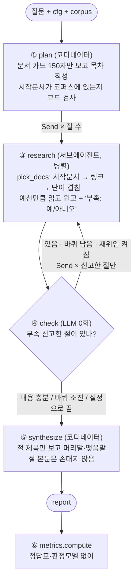

# REPORT

> 작성 중 (2026-09-23). 2차 실험(반복 3회) 결과와 6절 회고는 피어리뷰 전후로 채운다.

## 1. 주제와 코퍼스

**주제: 전기차·배터리 시장조사.** "이 시장의 누가, 무엇으로, 어떻게 경쟁하나"는 한 문서로 답이 안 나오고, 회사 · 기술 · 소재 · 정책 문서가 각각 필요하다.
질문마다 목차가 달라진다 (회사별 / 기술별 / 시간순) — 교안이 말한 "목차가 건마다 달라지는 문서"에 해당.

**코퍼스: 영어 위키백과 45건, 1,631,207자.**
- 창을 넘는가: 영어 ≈ 4자/토큰 → 약 41만 토큰. Claude Haiku 창 200k 토큰의 **2배**. 한 번에 다 넣을 방법이 없다
- 서로를 가리키나: 문서당 링크 중앙값 12, 링크 0개 문서 없음 (위키 내부 링크를 코퍼스 안으로 한정)
- 왜 영어인가: 한국어 위키로 먼저 모았더니 회사 문서가 너무 짧았다 (에코프로 713자, LG에너지솔루션 1,024자, SK온 1,251자, CATL 2,020자). 영어는 Tesla 94,228자, BYD Auto 94,686자
- 수집 과정의 실패: 1차는 "영어", "FIFA 월드컵" 같은 무관 문서가 절반 → 주제어 **밀도** 필터(1,000자당 0.5회 이상)와 시드 제목 검색을 넣어 해결
- 한계: 백과사전이라 최신 점유율·가격·전망은 약하다. 업로드(공개 보고서 PDF)로 보강하는 경로를 남겨 둠

**질문 10개** (`data/questions.json`): 한 건으로 답이 나오는 것 2 · 여러 갈래로 흩어진 것 6 · 한 대상을 따라가는 것 2. 질문마다 "왜 나눌 만한가"(또는 왜 나누면 안 되나)를 한 줄로 적었다.

## 2. 분업 설계

- **두 단계의 축을 일부러 다르게**: 수집은 고정 파트(시장규모 · 경쟁사 · 규제 · 가격 · 소비자 · 유통)로 넓게, 조사는 질문을 보고 **대상별**(회사 · 기술 · 세그먼트)로. 조사 목차까지 고정하면 코디네이터가 할 일이 없다
- **목차 규칙** (코디네이터 프롬프트): 형식(개요·분석·전망)이 아니라 조사 대상 단위로 / 최대 6절이지만 "칸을 채우려고 절을 만들지 마라" / 절마다 역할 · 시작 문서 · 영어 검색어
- **배정 검사는 코드가**: 시작 문서가 코퍼스에 없거나 다른 절과 겹치면 경보를 남기고 비워 둔다 (조용히 대체하지 않음)
- **구역은 코드가**: 병렬 조사관은 서로를 못 본다 → 파견 전에 절마다 겹치지 않는 문서 묶음을 나눠 준다 (LLM 0회). 끄면 각자 고른다
- **예산**: 절당 3건, 문서당 앞 6,000자. 재위임 시 3건 추가, 최대 2바퀴
- **재위임**: 조사관이 원고 끝에 '부족: 예'로 스스로 신고한 절만. 두 번째 원고는 인용 수가 첫 원고 이상일 때만 채택 (덮어쓰면 인용 빠진 원고가 멀쩡한 원고를 지운다), 읽은 기록은 누적
- **종합**: 코디네이터는 절 제목만 보고 머리말·맺음말만. 절 본문은 손대지 않는다 → 격리 유지 · 인용 보존
- **사람 개입 지점**: 데모에서 조사 전에 목차를 보여주고 '빼기 N'으로 절을 뺄 수 있게 (가장 싼 검수 지점)

## 3. 지표

정답표도 판정 모델도 쓰지 않는다. 만들어진 글과 실제로 읽은 기록만 본다.

| 지표 | 종류 | 계산 | 나쁘면 볼 장치 |
|---|---|---|---|
| 허위 인용 | 경보 (0이어야) | `set(인용) - 읽은 문서` | 그라운딩 · 조사 프롬프트 |
| 숫자 불일치 | 경보 (후보) | 문장 속 숫자가 그 문장이 인용한 원문에 없음 (날짜·서수 제외) | 그라운딩. 단 "five or six"처럼 단어로 쓴 원문은 오탐 → 사람이 확인 |
| 무효 시작문서 | 경보 (0이어야) | 코디네이터가 지어낸 제목 | 기획 프롬프트 · 문서 카드 |
| 인용 0개인 절 | 경보 (0이어야) | 원고에 «» 없음 | 역할 프롬프트 |
| 근거율 | 신호 | 인용 붙은 문장 / 전체 문장 (마침표 뒤 인용은 앞 문장 것) | 조사 프롬프트 (예산을 올려도 안 고쳐짐) |
| 인용 편중 | 신호 | 최다 인용 문서 비중 | 절 폭 — 한 절이 문서 하나에 기댐 |
| 중복률 | 신호 | 1 - 고유 읽음 / 읽기 시도 | 배정 · 구역 |
| 격리율 | 신호 | 코디네이터 글자 / 전체 글자 | 종합 구조 — 편집자가 본문을 보면 오른다 |

## 4. 파이프라인 구조도

| State 필드 | 리듀서 | 누가 쓰나 |
|---|---|---|
| `plan` | 덮어쓰기 | plan |
| `drafts` | `keep_better` — 재위임 원고는 인용 수가 첫 원고 이상일 때만 채택, 읽은 기록은 누적 | research |
| `round`, `stop_reason` | 덮어쓰기 | plan, check |
| `alarms`, `log` | 이어 붙이기 | plan / 전 노드 |

격리 측정: `llm.ask(coord=True/False)` 가 코디네이터와 서브에이전트가 받은 글자를 따로 센다 → `isolation = coord / (coord + sub)`.

## 4-1. 개발 중 발견한 실패와 추적 (2026-09-23)

같은 질문(Q3 한국 배터리 3사)을 고치면서 5번 돌렸다. 매번 보고서를 직접 읽고, 이상한 대목을 절 → 읽은 문서 → 코드 순으로 거슬러 올라갔다.

| # | 보고서에서 본 증상 | 추적 결과 (어느 절 · 어느 자료 · 어느 코드) | 조치 |
|---|---|---|---|
| 1 | "머리말과 맺음말을 작성하겠습니다", "자료를 검토했습니다…" 같은 말이 본문에 섞임 | 삼성SDI·SK온 절 원고(`sections/*.md`)부터 이미 섞여 있음 → 조사 프롬프트가 메타 발언을 막지 않음 | 프롬프트 + 제목·구분선 후처리 |
| 2 | 삼성SDI·SK온 절 본문엔 "자료가 부족하다"고 썼는데 재위임이 안 됨 | 신고 판별이 원고 **마지막 40자**만 봄. 모델은 신고를 본문 앞에 썼다 | 원고 전체에서 찾도록 |
| 3 | **같은 보고서인데 근거율이 32.1% → 37.0%** | 보고서는 그대로, `metrics.sentences()` 규칙만 바꿈 (마침표 뒤 인용을 앞 문장에 귀속). 교안이 경고한 "문장 분리 규칙이 바뀐 것"이 실제로 일어남 | 이후 비교는 전부 새 규칙으로 재채점. 수정 전 기록은 `_debug_runs_before_metric_fix.jsonl` 로 격리 |
| 4 | 숫자 불일치 경보 14건 | 12건이 날짜. 한국어 "2021년 10월 1일" vs 영어 원문 "October 1, 2021" | 날짜·서수는 검사 제외 → 2건 |
| 5 | 재위임 바퀴에서 세 절이 모두 Hyundai/Kia를 읽음 | 절 제목은 한국어, 문서는 영어라 단어 겹침 점수가 항상 0 → 링크 순서대로 집음. GM 문서의 링크가 Hyundai/Kia로 이어짐 | 코디네이터가 영어 검색어를 주고, 점수 우선 · 링크는 동점일 때만 |
| 6 | 멈춘 이유가 "내용 충분"인데 로그엔 전원 부족 신고 | `keep_better`가 채택 안 된 재위임 원고의 부족 표시를 지워 버림 | 표시 유지 → "바퀴 소진"으로 정직하게 |
| 7 | 재위임된 세 절이 같은 문서 3개를 읽음 (중복률 50%) | 병렬 조사관은 서로를 못 봐서 같은 인기 문서로 몰림 — 교안의 "배정이 중복을 막는다" 그대로 | 구역 켜면 파견 전에 코드가 겹치지 않게 배정 → 중복률 0% |
| 8 | 종합 단계 오류 "Reached maximum number of turns (1)" | Agent SDK의 `allowed_tools=[]` 는 자동승인 목록일 뿐, 도구는 보임 → 모델이 도구를 부름 | `tools=[]` 로 내장 도구 제거 + 1회 재시도 |

**인용 원문 대조 (Q7 BYD, 웹 데모 실행분)**: 숫자가 든 인용 15개를 원문에서 찾았다 → 15/15 있음.
- 숫자 불일치 경보 6건 중 "원가 5~6배"는 원문이 "five or six times" (숫자가 아니라 단어) → **경보는 확정이 아니라 사람이 볼 후보**
- 1절은 창업자를 "왕추안푸", 2절은 "왕전부"로 적음 (둘 다 Wang Chuanfu). 절을 따로 쓰고 편집자는 본문을 안 보는 구조라 **절끼리 어긋남은 구조상 못 잡는다** — 교안의 경고가 실제로 나옴

**목차 흔들림**: 같은 Q3에서 절 수가 3 → 5 → 5 → 3. Q1(CATL 한 건 질문)은 3 → 1 → 1.
Q7(BYD)의 5절 중 "글로벌 전기차 시장의 성장"은 BYD를 **밖으로 벌린** 절이었고, 그 절이 스스로 '부족'을 신고했다.

## 4-2. 1차 장치 끄기 실험 (반복 1회 — 참고용, 결론 아님)

질문 1(CATL 한 건) · 3(한국 3사) · 7(BYD 따라가기) × 기본 / 스위치 4개 하나씩 끔 / 혼자 하는 대조군. 16/18 성공 (2건은 주간 사용량 한도).

| 설정 | 근거율 | 편중 | 중복률 | 격리율 | 호출 |
|---|---|---|---|---|---|
| 기본 | 0.56 | 0.55 | 0.00 | 0.08 | 8.3 |
| 배정 끔 | 0.53 | 0.63 | 0.00 | 0.14 | 7.7 |
| **구역 끔** | 0.47 | 0.60 | **0.26** | 0.16 | 6.0 |
| 재위임 끔 | **0.69** | 0.46 | 0.00 | 0.12 | 5.7 |
| 링크 끔 | 0.43 | 0.69 | 0.00 | 0.21 | 4.5 |
| ~~대조군~~ | ~~0.22~~ | | | 1.00 | 1.0 |

관찰:
- **구역을 끄면 중복률이 0 → 26%** (Q7은 50%). 구역이 하는 일은 교안대로 낭비를 줄이는 것
- **재위임을 끄니 근거율이 오히려 높다** (0.69 vs 0.56). 교안 섹션 15의 "재위임을 껐더니 근거율이 오히려 좋아지는 경우가 잦았다"와 같은 방향. 재위임 원고는 '부족'이라 신고한 절이 억지로 쓴 것이라 인용이 약할 수 있다 — 반복 측정으로 확인할 것
- **같은 Q1 기본 설정 안에서도 근거율이 0.25~0.77로 흔들린다** → 1회 결과로 순위를 매기면 안 된다

**대조군이 불공정했다 (직접 확인해서 발견)**: 대조군이 읽은 24건이 코퍼스 저장 순서와 거의 같았다.
한국어 질문으로 영어 문서 점수를 매기니 전부 0점 → 앞에서부터 집음. Q3(한국 3사)인데 **LG Chem을 안 읽었다**.
팀은 코디네이터가 영어 검색어를 주는데 대조군엔 그 기회가 없었고, 글쓰기 규칙(인용 위치)도 달랐다 — 교안이 말한 "상대 손발을 묶어 놓고 이긴 것".
→ 대조군도 같은 문서 카드를 보고 시작 문서·검색어를 스스로 고르게, 글쓰기 규칙도 팀과 같게 고침. 1차 결과는 `output/ablation_run1_unfair_baseline.json` 에 보관하고 비교에서 뺀다.

2차 실험: 같은 3문항 × 6설정 × **반복 3회**, 공정한 대조군으로 재실행 중.

## 5. 데모 설계

`uvicorn app:app` → http://localhost:8000. 왼쪽은 대화, 오른쪽은 진행 과정, 아래는 보고서.

| 단계 | 화면에서 일어나는 일 | 신경 쓴 점 |
|---|---|---|
| 1 시장 정하기 | 봇이 한 번에 후속 질문 하나씩 (지역 · 세그먼트 · 기간 · 목적), 충분하면 "정리: …" | 최대 3턴에서 끊는다 — 끝없이 묻지 않게 |
| 2 자료 | 드래그앤드롭 업로드 (txt · md · pdf) → 코퍼스와 합쳐 준비 여부를 코드가 판정 | 부족하면 "이 자료만 분석 / 웹에서 더 찾기"를 사용자가 고른다 |
| 3 목차 확인 | 코디네이터가 짠 목차 + 경보(무효 시작문서) → '예' / '빼기 N' / '다시' | 가장 싼 사람 검수 지점. 밖으로 벌린 절을 조사 전에 뺀다 |
| 4 조사 | 진행 패널에 "조사: 절 (바퀴) 읽음 [...] · 부족 신고", "점검: … → 재위임/바퀴 소진" 이 실시간으로 | 숫자만이 아니라 **누가 무엇을 읽었는지**가 보이게 |
| 보고서 | 인용은 `[1]` 로 숨김 → 마우스를 올리면 문서 제목, 누르면 원문 앞부분. 절마다 "이 절을 쓴 조사관이 읽은 문서" 펼침. 지표 한 줄 | 마음에 안 드는 문장을 바로 원문과 대조할 수 있게 |

(화면 캡처: 추가 예정)

## 6. 회고 (직접 작성)

- 가장 공들인 부분:
- 향후 보완하고 싶은 점:
- 참고 — 개발 중 기록된 사실: 코드 스텁 · 대조군 · 실험 · 웹 연결 · 대화 흐름은 OpenCode 무료 모델에 명세(`_delegation/`)를 주고 맡긴 뒤 리뷰했다. 코디네이터가 서브에이전트에게 일을 나누는 이 프로젝트 구조를 개발 과정에서도 그대로 썼다
